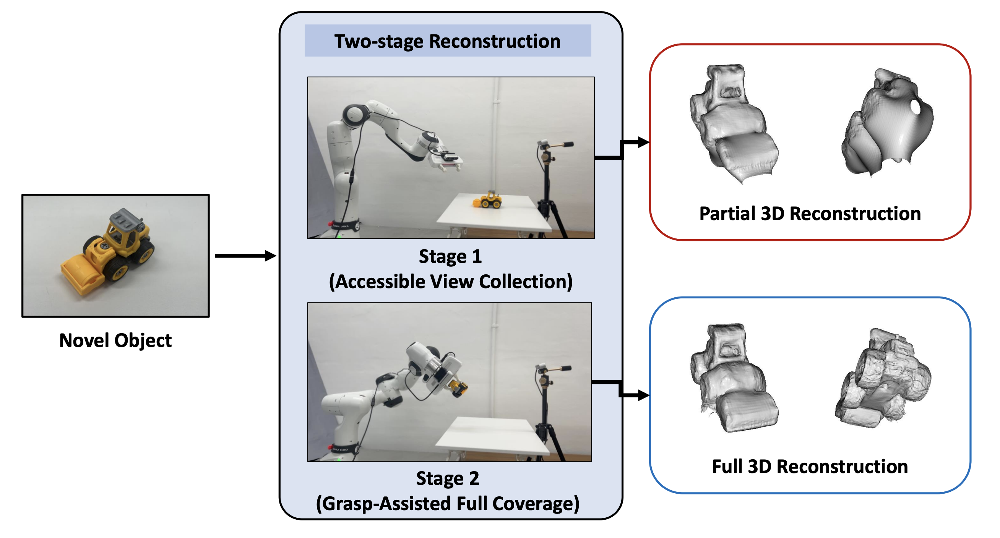
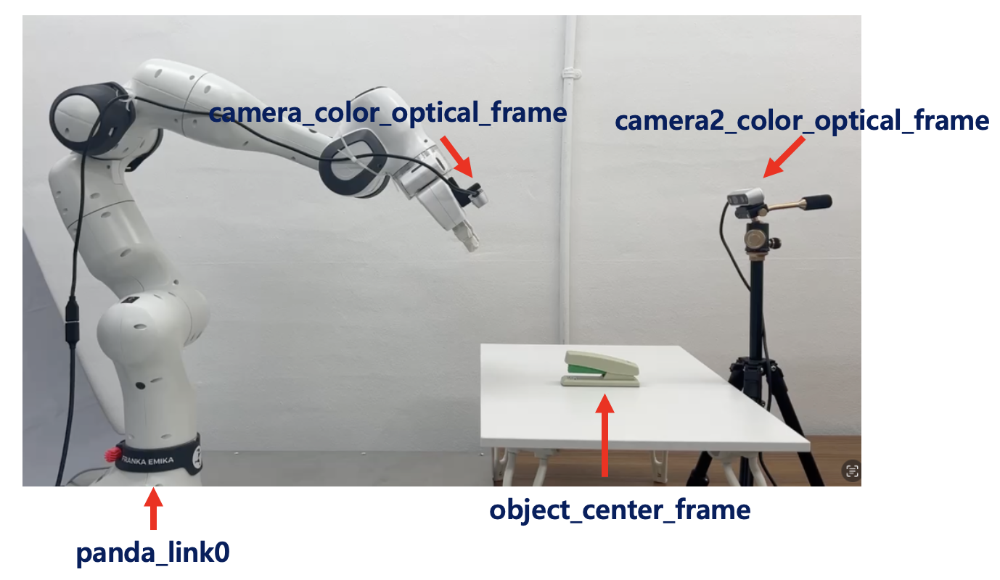
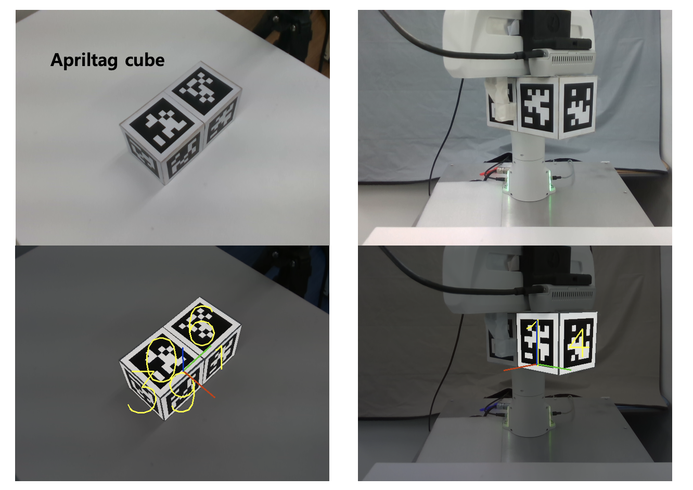
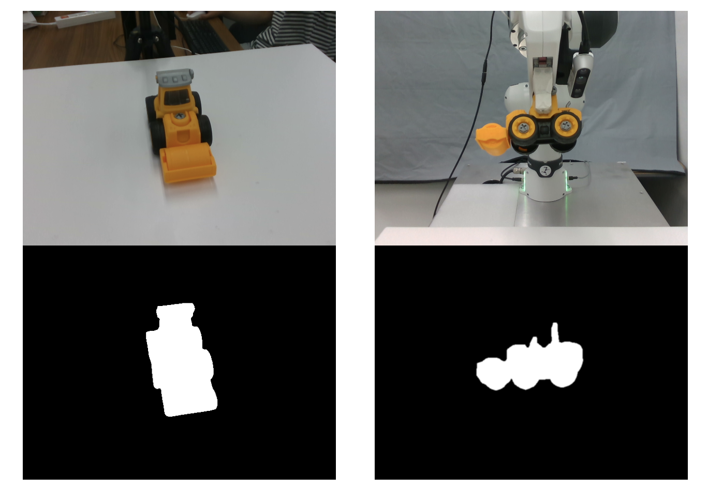

# **See-Then-Grasp: Object Full 3D Reconstruction via Two-Stage Active Robotic Reconstruction Using Single Manipulator**

### [Paper](https://www.mdpi.com/2076-3417/15/1/272)

This repository is the official implementation of our paper, **See-Then-Grasp: Object Full 3D Reconstruction via Two-Stage Active Robotic Reconstruction Using Single Manipulator.**



## Prerequisite
Our setup utilizes a single [Franka Panda robot](https://github.com/moveit/panda_moveit_config) and two [RealSense cameras](https://github.com/IntelRealSense/realsense-ros). One camera is set as the robot’s hand-eye camera, while the other is configured as an external fixed camera. We  highly recommend setting up a robot environment identical to our configuration by referring to the image below.



Next, as mentioned in the paper, we use an [AprilTag](https://github.com/AprilRobotics/apriltag) cube to pre-generate the poses to which the robot should move. Please prepare an AprilTag cube as shown below and install Apriltag module. Make sure the cube is of a size that the robot can grasp.



## Installation
All codes are based on environment below. Please install them first.
- Python 3.8.10
- Pytorch 1.11.0
- CUDA 11.3

Next, install libraries in conda environment.

```
git clone https://github.com/volunt4s/SeeThenGrasp.git
cd SeeThenGrasp
conda create -n STG python=3.8
pip install requirements.txt
```

Also, this version utilizes [SAM-HQ](https://github.com/SysCV/sam-hq) and [YOLO](https://github.com/ultralytics/ultralytics) to get segmentation image of unseen object. Please install them with the link we provided. However, you are not limited to our setup and may use a superior custom segmentation module, such as Grounded-SAM.

## Preprocess
First, pre-collect the Apriltag cube’s information using the command below. We control the robot using the ROS service we developed, but any robot command capable of performing the task will suffice.
```
sh 1_preprocess_cube.sh
```

(Optional) Use the code below to verify that you can successfully obtain the object’s segmentation mask. Depending on the object detection and segmentation model, the code may vary. Please refer to our provided code and use the appropriate model-specific code.
```
sh 2_preprocess_img.sh
```
The best-case scenario is when an image like the one shown below appears.


## Training
Once all settings are complete, enter the code below to start training.
```
sh 3_run_STG.sh
```
After training is complete, you can check the data in the following directory.

```
SeeThenGrasp/recon_src/Voxurf/log/(your exp)
```

## Citation
If you find our work useful for your research, please consider citing the following papers!
```bibtex
@article{hong2025see,
  title={See-Then-Grasp: Object Full 3D Reconstruction via Two-Stage Active Robotic Reconstruction Using Single Manipulator},
  author={Hong, Youngtaek and Kim, Jonghyeon and Cha, Geonho and Kim, Eunwoo and Lee, Kyungjae},
  journal={Applied Sciences},
  volume={15},
  number={1},
  pages={272},
  year={2025},
  publisher={Multidisciplinary Digital Publishing Institute}
}
```

## Acknowledgement
Our code is inspired by [DVGO](https://github.com/sunset1995/DirectVoxGO), [Voxurf](https://github.com/wutong16/Voxurf). Thanks to the authors for their awesome works and great implementations!